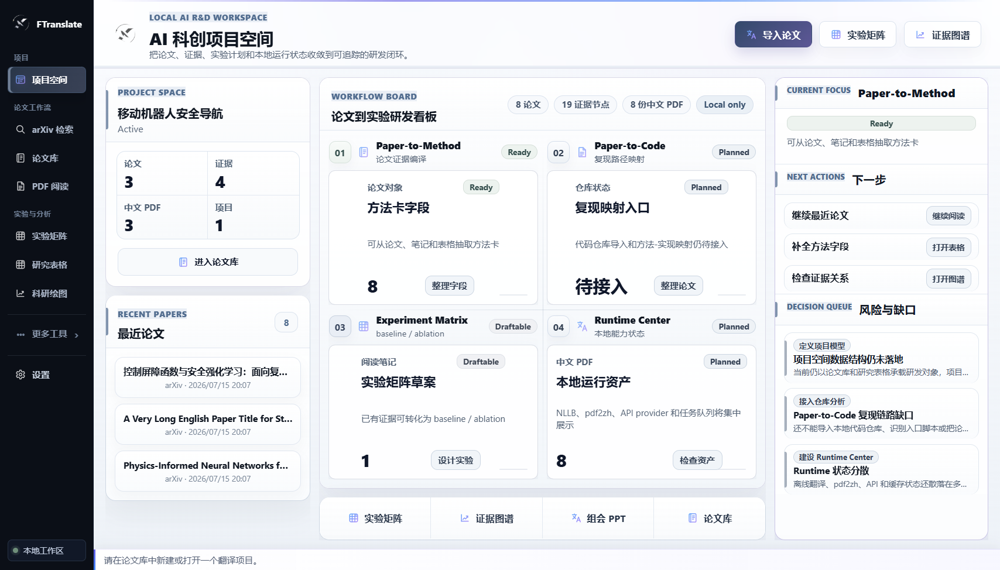
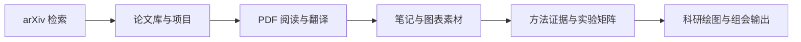
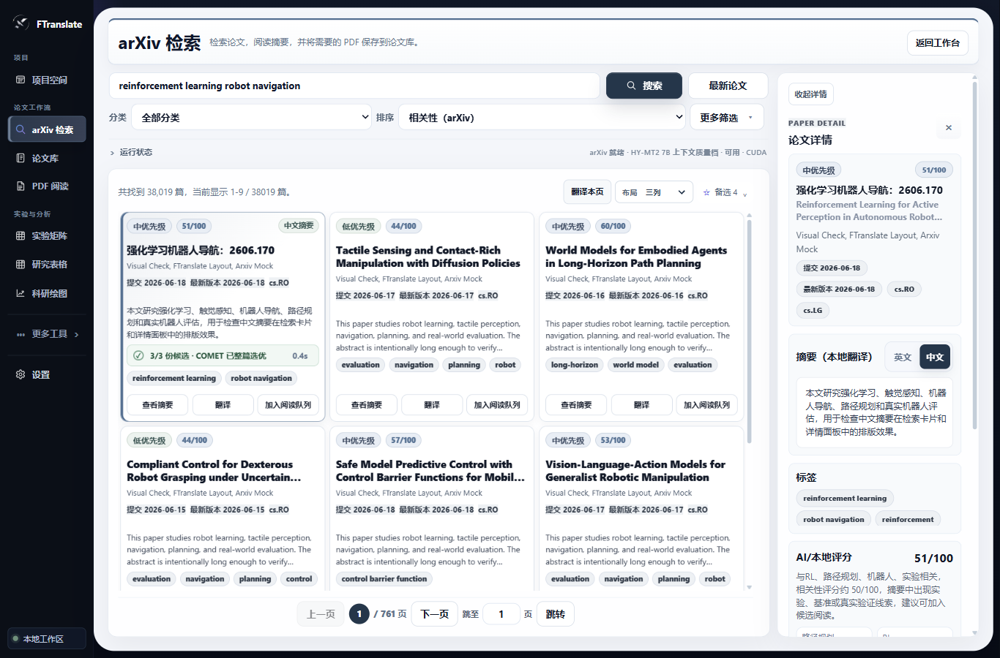
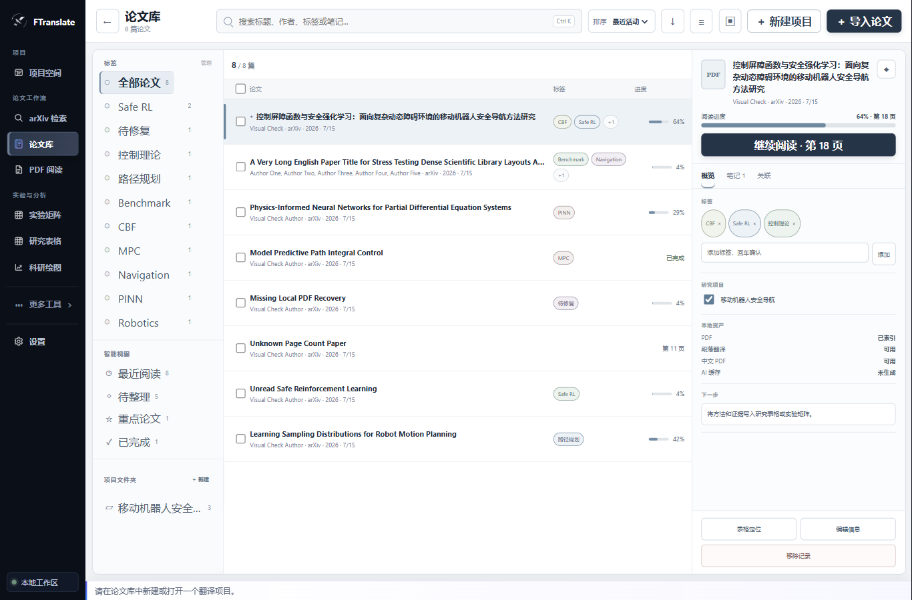
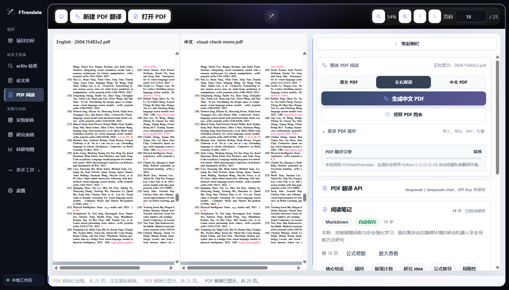

# FTranslate

<p align="center">
  
</p>

<p align="center"><strong>面向科研人员的本地优先 AI 科研工作台</strong></p>

<p align="center">
  <code>v0.1.38</code>
  · <code>Windows</code>
  · <code>Local-first</code>
  · <code>Active development</code>
</p>

<p align="center">
  <a href="#产品工作流">产品工作流</a> ·
  <a href="#核心能力">核心能力</a> ·
  <a href="#快速开始">快速开始</a> ·
  <a href="#当前状态">当前状态</a> ·
  <a href="#开发与验证">开发与验证</a>
</p>

FTranslate 将论文检索、论文库、PDF 阅读与翻译、证据整理、实验设计、科研数据和研究输出连接到一个本地工作区。它的目标不是再增加一个孤立的 PDF 翻译入口，而是让论文从“找到”到“形成可验证研究计划”的过程可以持续积累、追踪和复用。

当前主平台是 Windows 桌面端，安装包名称仍保留为 **PDF Translation Reader**。项目处于 0.1.x 活跃开发阶段；核心论文工作流已经可用，Paper-to-Code 和更高层自动研发流程仍在建设中。



## 为什么做 FTranslate

科研论文工作通常分散在浏览器、PDF 阅读器、翻译工具、笔记、表格、绘图脚本和演示文稿之间。论文看过了，但检索条件、译文、证据、图表、实验想法和下一步动作很难保持关联。

FTranslate 以“论文对象 + 研究项目”为中心，把这些分散步骤收进同一个本地工作台：

- 检索结果可以直接进入论文库，而不是停留在浏览器标签页；
- 原文、中文 PDF、左右双语、划词翻译和笔记共享同一阅读上下文；
- 图表素材、方法证据和实验矩阵能够继续服务科研绘图与组会输出；
- 本地模型、Python/R/MATLAB 和云端 API 的状态可检测、可降级、可解释。

## 产品工作流



这条工作流由六个真实入口组成：

1. 使用英文或中文科研概念检索 arXiv；
2. 将候选论文保存到本地论文库并归入研究项目；
3. 阅读原文 PDF、纯中文 PDF 或左右双语视图；
4. 进行划词翻译、单词查询、阅读笔记和图表提取；
5. 整理论文方法、证据关系与 baseline / proposed / ablation 实验矩阵；
6. 在研究表格、科研绘图和组会 PPT 中继续使用这些研究资产。

<table>
  <tr>
    <td width="33%"></td>
    <td width="33%"></td>
    <td width="33%"></td>
  </tr>
  <tr>
    <td align="center">arXiv 检索</td>
    <td align="center">论文库</td>
    <td align="center">PDF 阅读</td>
  </tr>
</table>

## 核心能力

### 发现与管理论文

- **arXiv 官方检索**：直接使用官方 Atom API，默认保持 arXiv 全局相关性顺序。
- **中文复合概念查询**：不同概念使用 AND，同一概念的可信别名使用 OR；实际英文表达式可以展开查看。
- **备选论文队列**：先暂存候选，再决定是否加入正式论文库。
- **本地论文库**：支持标题、作者、标签、笔记搜索，以及最近添加、标题和阅读进度排序。
- **研究项目**：可创建空项目，也可关联当前或批量选中的论文。
- **阅读状态**：记录页码、进度、收藏、重点论文、待整理和已完成等本地状态。

### 阅读与翻译论文

- **PDF.js 本地阅读**：打开后默认适宽、居中并恢复阅读页码；普通论文首屏设有 3 秒自动回归预算。
- **三种阅读模式**：原文 PDF、纯中文 PDF、原文与中文左右双语。
- **划词即译**：选择完成后自动翻译，浮层跟随真实选区；拖选过程中不闪烁、不重复请求。
- **双击单词词典**：保留 PDF 文字层的整词选区，显示译文、词性与释义；联网词典需要用户显式启用。
- **整篇中文 PDF**：通过 PDFMathTranslate / pdf2zh 生成中文单语 sidecar，支持论文库有界并发批量任务。
- **本地学术翻译**：HY-MT2 负责主要翻译，NLLB / Argos 提供本地降级。
- **COMET-MBR 选优**：对三份完整论文级候选先执行结构硬门禁，再选择整篇最优候选，不跨候选拼句。
- **可解释降级**：候选不足、运行时缺失、资源不足或评估失败都会显示真实状态，不伪装成高质量完成。

### 沉淀证据与实验

- **阅读笔记**：Markdown、公式、页码和当前论文关联，自动保存。
- **图表素材工作台**：从完整页面高分辨率渲染提取图表，支持候选筛选、原页定位、整页预览、手动精裁和批量 PNG 导出。
- **Paper-to-Method**：从论文、笔记和图表说明整理方法卡字段，并保留证据来源。
- **证据图谱**：将论文、方法、指标、实验和笔记关系可视化，支持本地导出。
- **实验矩阵**：围绕 baseline、proposed method 和 ablation 组织实验行、变量、指标、证据与状态。
- **可回滚数据**：项目、论文、标签、笔记和实验对象使用本地持久化，不依赖在线账号。

### 分析与输出

- **研究表格**：基于 Univer 的独立工作表，支持 CSV/XLSX 导入导出、绑定研究对象和数据验证。
- **科研绘图**：支持 CSV、TSV、XLSX、剪贴板和研究表格数据；提供折线、散点、柱状、热图、相关矩阵、森林、火山、雷达等受控图形。
- **多语言渲染**：JavaScript/ECharts 内置预览；Python、R 和 MATLAB 使用检测到的真实环境渲染与导出脚本。
- **统计分析**：描述统计、置信区间、回归、参数/非参数检验和多重比较校正；无效设计会明确报错。
- **组会 PPT**：从论文结构、真实图表素材和研究内容生成可编辑 PPTX 草稿。
- **AI 助手与论文导师**：可选连接 OpenAI-compatible API，用于问答、提示词模板和研究分析，不是核心本地阅读链路的前置条件。

## 当前状态

| 能力 | 状态 | 当前边界 |
| --- | --- | --- |
| 项目空间、论文库、标签与阅读进度 | 可用 | 本地工作区，无账号同步 |
| arXiv 检索、详情、备选和保存 PDF | 可用 | 依赖 arXiv 官方 API |
| PDF 阅读、中文 PDF、左右双语 | 可用 | 扫描件可能需要 OCR；中文 PDF 依赖 sidecar |
| 划词翻译、单词词典与学术术语保护 | 可用 | 联网词典为显式可选增强 |
| HY-MT2 / NLLB / Argos 本地翻译 | 可用 | 大模型与运行时外置安装 |
| COMET-MBR 三候选选优 | 可用、可降级 | 冷启动和内存成本较高 |
| 图表提取与素材工作台 | 可用 | 异常排版可能需要手动精裁 |
| 方法卡、证据图谱与实验矩阵 | 可用 / 持续完善 | 自动抽取结果仍需研究者核对 |
| 研究表格、科研绘图与组会 PPT | 可用 | 外部绘图语言依赖本机环境 |
| iPhone 本地阅读版 | 实验性 | 独立移动闭环，不等同桌面完整功能 |
| Paper-to-Code 完整 UI | 规划中 | 已有只读扫描与 headless demo，尚未形成完整产品闭环 |
| Research Autopilot | 规划中 | 不作为当前能力宣传 |

## 0.1.38 版本亮点

- arXiv 普通搜索改为官方全局相关性排序，不再对当前页进行本地二次重排。
- HY-MT2 使用固定 seed 生成三份标题与完整摘要候选，先经过公式、引用、方法名、数字、截断和上下文泄漏门禁。
- 外置 COMET worker 对完整候选执行 MBR 评估；最终只选择一份完整译文。
- 批量候选生成、单候选和后备引擎均按论文隔离故障，单篇坏样本不会拖垮整批。
- 翻译卡片显示候选生成、结构校验、质量评估、降级与完成阶段。
- COMET 模型不进入 NSIS 安装包；运行中心负责检测、安装提示和真实降级说明。

完整版本历史见 [CHANGELOG.md](CHANGELOG.md)。

## 快速开始

### 前置条件

- 当前主开发与交付平台：Windows；
- Node.js 与 npm；
- Git；
- 本地翻译、中文 PDF 和外部绘图语言按需安装，不是启动基础 UI 的前置条件。

仓库目前没有公开 GitHub Release。请从源码运行，或在本机构建 Windows 安装包；不要从未知来源下载安装器。

### 从源码运行

```powershell
git clone https://github.com/enterx-x/FTranslate.git
cd FTranslate
npm install
npm run dev
```

`npm run dev` 会启动 Vite renderer、构建 Electron main/preload，并打开桌面应用。

### 构建与打包

```powershell
npm run build
npm run dist
```

- `npm run build`：运行测试、两套 TypeScript 检查、renderer 构建和 Electron main 构建；
- `npm run dist`：在完整构建通过后生成 Windows NSIS 安装包；
- 当前版本产物名称：`dist/PDF Translation Reader Setup 0.1.38.exe`；
- 安装器为当前用户安装，允许选择目录，并创建桌面与开始菜单快捷方式。

如果 Vite 构建阶段出现 Node 内存不足，可临时提高 heap：

```powershell
$env:NODE_OPTIONS='--max-old-space-size=4096'
npm run dist
```

## 翻译与运行环境

| 运行能力 | 作用 | 安装与检测策略 |
| --- | --- | --- |
| HY-MT2 7B / 1.8B | 标题、摘要、划词和段落学术翻译 | 外置 GGUF + llama.cpp；脚本 `scripts/install-hymt2-gguf.ps1` |
| COMET-MBR | 三候选整篇质量评估 | 外置 Python 环境；脚本 `scripts/install-comet-mbr.ps1` |
| NLLB + CTranslate2 | 快速标题与本地降级 | 独立环境；脚本 `scripts/install-nllb-ct2.ps1` |
| Argos | 本地摘要降级 | 检测已安装环境 |
| PDFMathTranslate / pdf2zh | 生成纯中文 PDF | 优先检测现有安装；必要时创建应用私有 Python 环境 |
| JavaScript / ECharts | 科研绘图即时预览 | 应用内置 |
| Python / R | 真实科研绘图与脚本导出 | 优先使用依赖完整的全局环境，缺失时可安装私有环境 |
| MATLAB | 商用绘图环境 | 只检测已有授权安装，FTranslate 不安装 MATLAB |
| OpenAI-compatible API | AI 助手、论文导师、PDF 云端翻译增强 | 可选；支持 OpenAI、DeepSeek、Kimi 和 Custom provider |

本地大模型不会被打进约 150 MB 的桌面安装包。应用会优先复用可用系统环境；只有完全缺失或依赖不完整时才提供明确安装或修复入口，不静默修改系统 `PATH`。

## 质量与性能证据

以下数字来自当前仓库已经执行的自动基准和真实应用验证，不代表未经审签的营销准确率。

| 质量门 | 当前证据 |
| --- | --- |
| PDF 首屏 | 12 页 / 15.0 MB 样本 636 ms；25 页 / 15.6 MB 样本 1,687 ms；预算 3,000 ms |
| arXiv 检索 | 20 条中英文真实 API 查询：P@10 0.990、nDCG@10 0.923、Top-10 跑题率 0.010 |
| 学术翻译 | 30 条、10 领域：硬门禁/受保护内容/禁用误译 100%，MBR 术语召回 99.17% |
| COMET 差值 | 单候选 0.84889 → MBR 0.85593，提升 +0.00704；7/10 领域上升 |
| COMET 运行时 | 冷态 6 对约 12.6 秒，暖态约 2.6–2.8 秒，峰值工作集约 5.24 GB |
| 自动化 | 107 个测试文件通过、1 个跳过；746 项通过、3 项跳过 |
| UI | 源码版与安装包内 arXiv 专项视觉门禁通过，覆盖 1366/1440/1920px |

COMET、术语召回和结构门禁只能证明可重复的自动质量改进，不能替代领域专家对忠实度、术语、流畅性和完整性的独立盲评。

## 本地优先与隐私边界

- 论文、项目、标签、笔记、实验对象和大部分缓存默认保存在本机；
- 本地 HY-MT2、NLLB、Argos 和 COMET 工作流不需要把论文内容发送到聊天式 AI；
- 启用 OpenAI-compatible API 或云端 PDF 翻译 provider 时，对应功能所需文本会发送到用户选择的服务；
- API Key 保存在本机 Electron 配置，不写入日志，也不应提交到 Git；
- 在线词典首次启用前会说明只发送当前单词，并可随时关闭；
- 本项目尚未声明企业级数据隔离、医疗/金融合规或第三方安全认证。

## 当前限制

- Windows 是当前完整桌面平台；macOS/Linux 尚未作为正式安装包验证。
- iOS 版本是个人实验性移动阅读路径，详情见 [iPhone 实验版与个人自签](docs/ios-self-sideload.md)。
- 本地模型首次安装、冷启动和 COMET 评分需要额外磁盘、内存与等待时间。
- 扫描 PDF、损坏文件、异常字体、复杂多栏排版和非标准 caption 可能需要 OCR 或人工校正。
- 图表提取优先还原 PDF 页面视觉，但复杂组合图仍可能需要手动精裁。
- 自动翻译和方法抽取必须保留原文供研究者核对。
- 当前没有账号、云同步和团队权限系统。
- Paper-to-Code 完整界面、自动复现执行和 Research Autopilot 尚未完成。

## 开发与验证

### 常用命令

```powershell
npm run dev                 # Electron 开发模式
npm test                    # Vitest
npm run typecheck           # renderer + Electron TypeScript
npm run build               # 完整源码构建
npm run dist                # Windows NSIS
npm run visual:check        # 桌面视觉回归
npm run visual:check:mobile # iPhone 尺寸视觉回归
```

检查安装包内的实际界面：

```powershell
npm run dist
$env:VISUAL_CHECK_PACKAGED='1'
npm run visual:check
```

截图与结构化审计输出到 `.tmp-visual-check/`。视觉门禁不仅检查页面能否打开，也检查重叠、遮挡、截断、横向溢出、空白工作台、PDF 真实 canvas、首屏预算和多桌面宽度。

### 技术栈

- Electron + React + TypeScript + Vite；
- PDF.js 本地 PDF 渲染；
- PDFMathTranslate / pdf2zh 中文 PDF sidecar；
- Univer 研究表格；
- ECharts / ECharts GL 科研绘图；
- KaTeX + Markdown 公式与笔记；
- PptxGenJS 可编辑 PPTX；
- Vitest + TypeScript + 自定义 Electron/CDP 视觉门禁；
- electron-builder + NSIS Windows 打包。

### 架构边界

```text
src/
  main/                    Electron 生命周期、IPC、运行时与 sidecar
    ipc/handlers/          AI、arXiv、PDF、文件和项目 IPC
    runtimeCenter.ts       本地能力、任务与降级状态
    arxivTranslationService.ts
    cometMbrRuntime.ts
  renderer/
    components/            项目空间、arXiv、论文库、PDF、实验与输出页面
    contexts/              PDF、论文库、AI 翻译与 UI 状态边界
    hooks/                 领域状态与本地持久化
    lib/                   方法卡、实验矩阵、图谱、PPT 和数据模型
  shared/                  跨进程类型、学术术语与翻译质量规则
scripts/                   运行时安装、基准、构建和视觉验证
assets/                    图标与打包运行资源
```

Electron main 负责文件系统、运行时探测、模型进程和安全 IPC；preload 只暴露受控 API；React renderer 不直接访问系统能力。Python/R/MATLAB 和翻译模型作为可检测的外部运行时存在，避免把大型环境强行打进安装包。

### 进一步阅读

- [版本历史](CHANGELOG.md)
- [执行计划与问题台账](PLAN.md)
- [产品与 UI 设计基准](DESIGN.md)
- [产品型 README 重构规格](docs/specs/2026-07-18-product-readme-redesign.md)
- [iPhone 实验版与个人自签](docs/ios-self-sideload.md)

## 参与开发

开始修改前请先阅读 `README.md`、`PLAN.md` 和 `DESIGN.md`。代码变更应保持可复现、可解释、可回滚，并运行与范围匹配的测试；UI 变更还必须执行视觉门禁并人工检查截图。

当前仓库尚未提供许可证文件。除非仓库后续明确加入许可证，否则不要假定代码可用于任意再分发或商业用途。
