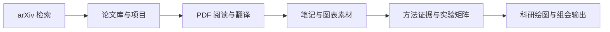

# Product-first README Implementation Plan

> **For agentic workers:** REQUIRED SUB-SKILL: Use `executing-plans` for inline implementation. Do not dispatch subagents for this documentation task.

**Goal:** Replace the 1,040-line development-log-style README with a truthful product-first README, while preserving release history and detailed iOS setup outside the main product narrative.

**Architecture:** Keep `README.md` as the public product entrypoint, move version history to `CHANGELOG.md`, move the long experimental iOS self-sideload guide to `docs/ios-self-sideload.md`, and commit four sanitized screenshots under `docs/images/`. Update `PLAN.md` with the documentation decision and validate all local links, image references, line count, whitespace, and Git scope.

**Tech Stack:** Markdown, Mermaid, PNG screenshots from the existing visual gate, PowerShell/Node link checks, Git.

---

### Task 1: Preserve historical content outside README

**Files:**
- Create: `CHANGELOG.md`
- Create: `docs/ios-self-sideload.md`
- Read: `README.md`

- [x] **Step 1: Extract the release history scope**

Read the current README headings and preserve the release notes for 0.1.18–0.1.38 plus the late 0.1.17/UI notes. Do not copy installation commands that point to obsolete package versions into the new README.

Run:

```powershell
Select-String -Path README.md -Encoding utf8 -Pattern '^## .*\(0\.1\.[0-9]+.*\)|^## 2026-' | ForEach-Object { "{0}: {1}" -f $_.LineNumber,$_.Line }
```

Expected: version/date headings are listed with their original line numbers.

- [x] **Step 2: Create CHANGELOG.md**

Create an intro that states the changelog preserves user-visible changes and that detailed execution evidence lives in `PLAN.md`. Keep versions in descending order. The top entry must be 0.1.38 and retain its arXiv official relevance and COMET-MBR evidence; older entries retain their user-visible summaries without being presented as current instructions.

- [x] **Step 3: Create the iOS guide**

Move the experimental iPhone build, GitHub Actions, Sideloadly, free Apple ID, Developer Mode, first USB pairing, renewal, and limitations into `docs/ios-self-sideload.md`. Start the file with an explicit warning that this is an experimental personal self-install path, not App Store distribution and not feature-equivalent to desktop.

- [x] **Step 4: Check the new documents**

Run:

```powershell
git diff --check -- CHANGELOG.md docs/ios-self-sideload.md
```

Expected: no whitespace errors.

### Task 2: Add sanitized product screenshots

**Files:**
- Create: `docs/images/ftranslate-workspace.png`
- Create: `docs/images/ftranslate-arxiv.png`
- Create: `docs/images/ftranslate-library.png`
- Create: `docs/images/ftranslate-pdf-reader.png`
- Source: `.tmp-visual-check/home.png`
- Source: `.tmp-visual-check/arxiv-search-results-1366.png`
- Source: `.tmp-visual-check/paper-library-1366.png`
- Source: `.tmp-visual-check/whole-pdf-reader.png`

- [x] **Step 1: Verify source screenshots**

Confirm all four files exist, are valid PNGs, and contain visual-check fixture data rather than API keys, local absolute paths, or private user documents.

Run:

```powershell
Get-Item .tmp-visual-check/home.png,
  .tmp-visual-check/arxiv-search-results-1366.png,
  .tmp-visual-check/paper-library-1366.png,
  .tmp-visual-check/whole-pdf-reader.png |
  Select-Object Name,Length
```

Expected: four non-empty PNG files.

- [x] **Step 2: Copy only the approved screenshots**

Copy the four exact files to `docs/images/` using the destination names above. Do not copy other `.tmp-visual-check` artifacts.

- [x] **Step 3: Verify image signatures and scope**

Run a signature check that requires the first eight bytes to be `89 50 4E 47 0D 0A 1A 0A`, then confirm Git shows exactly four new image files under `docs/images/`.

### Task 3: Rewrite README as the product entrypoint

**Files:**
- Replace: `README.md`
- Reference: `docs/specs/2026-07-18-product-readme-redesign.md`
- Reference: `CHANGELOG.md`
- Reference: `docs/ios-self-sideload.md`
- Reference: `PLAN.md`
- Reference: `DESIGN.md`

- [x] **Step 1: Write the hero and navigation**

Use `# FTranslate` as the title and the approved local-first AI research workbench positioning. Show plain badges for version 0.1.38, Windows, local-first, and active development. Link to product workflow, quick start, current status, and development sections. Do not add a GitHub Release link because no release currently exists.

- [x] **Step 2: Add real screenshots and product workflow**

Embed `docs/images/ftranslate-workspace.png` as the main screenshot. Add a compact three-image feature gallery for arXiv, library, and PDF reading. Add a Mermaid flow limited to implemented user actions:



- [x] **Step 3: Describe current capabilities by user task**

Use four sections: discover/manage, read/translate, evidence/experiments, analysis/output. Mark experimental capabilities explicitly and do not present planned Paper-to-Code/Research Autopilot as complete.

- [x] **Step 4: Add quick start and runtime table**

Include only verified commands:

```powershell
npm install
npm run dev
npm run build
npm run dist
```

Explain the optional external HY-MT2, COMET-MBR, NLLB/Argos, PDFMathTranslate, Python/R/MATLAB, and OpenAI-compatible API boundaries without claiming automatic installation of commercial software.

- [x] **Step 5: Add quality evidence, privacy, limits, and development**

Retain the current verified arXiv, translation, PDF first-render, test, build, and packaged visual evidence. State that automatic COMET metrics do not replace independent expert review. Add local-first data/API boundaries, Windows-first status, iOS experiment link, current limitations, scripts, and a concise architecture map.

- [x] **Step 6: Keep README within the product budget**

Run:

```powershell
$count = (Get-Content README.md -Encoding utf8).Count
if ($count -lt 250 -or $count -gt 400) { throw "README line budget failed: $count" }
```

Expected: 250–400 lines.

### Task 4: Record the documentation decision

**Files:**
- Modify: `PLAN.md`

- [x] **Step 1: Add a 0.1.38 README productization record**

Record the old 1,040-line structure, the new product-first hierarchy, the screenshot set, historical migration, lack of GitHub Release, and the documentation-only validation boundary. State that application code and installer artifacts were not rebuilt because this change cannot affect runtime behavior.

- [x] **Step 2: Check PLAN formatting**

Run:

```powershell
git diff --check -- PLAN.md
```

Expected: no whitespace errors.

### Task 5: Validate all documentation and Git scope

**Files:**
- Verify: `README.md`
- Verify: `CHANGELOG.md`
- Verify: `docs/ios-self-sideload.md`
- Verify: `docs/images/*.png`
- Verify: `PLAN.md`

- [x] **Step 1: Check README structure**

Assert that README contains the approved product title, workflow, quick start, status, privacy, limitations, development section, current version, and four image references. Assert that no top-level date/version changelog headings remain.

- [x] **Step 2: Check local links and images**

Run an inline Node script that extracts relative Markdown links and image paths from README, ignores anchors and HTTP(S) links, resolves paths from the repository root, and fails on any missing target.

Expected: every local target exists.

- [x] **Step 3: Run repository hygiene checks**

Run:

```powershell
git diff --check
git status --short
git diff --stat
```

Expected: only README, CHANGELOG, PLAN, the iOS guide, the implementation plan, and four approved images are changed; the two protected `.superpowers/brainstorm/` directories remain untracked and unstaged.

- [x] **Step 4: Commit and push**

Stage only the explicit documentation and screenshot paths, commit with:

```text
docs: rewrite readme as product overview
```

Push `codex/scientific-plot-axis-controls` and verify local and remote SHA equality. Do not run `npm run build` or `npm run dist` because the change is documentation-only.
